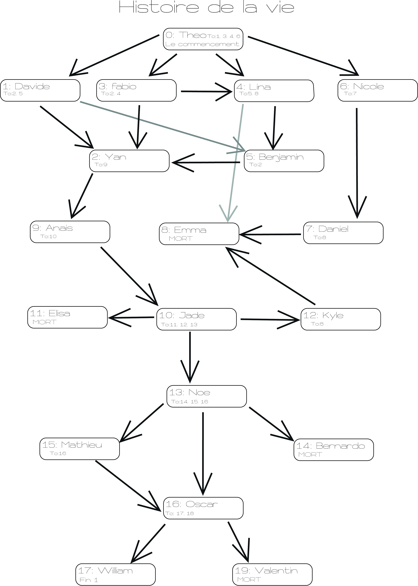

# Histoire-de-la-vie

## Principe du projet

Ce projet consiste à créer une histoire a choix multiple ou le déroulement dépend des choix du lecteur. Ainsi nous devons créer différentes pages html pour les assembler et former une suite de pages pour l’aventure.

[Voir le projet](https://eracom-id491.github.io/Histoire-de-la-vie/)

## Thème

Suite à la discussion du 13 mai, le concept suivant à été proposé:

> "Chaque personne crée une chambre. Avec un moyen d'accès aux chambres suivantes. Le passage passe par des portes (ou des trous, des entrées de grotte, ce que vous voulez comme sortie). Il y a pas de fil conducteur, on peut passer d'un froid polaire à un lieu enflammé...".

### Qu'est-ce qui se passe pour les situations de "mort" (Game Over)?

Vous avez dans ce cas deux options: Vous pouvez créer une chambre "sans issue", et le personnage devra revenir en arrière. Ou votre chambre peut contenir un "piège fatal". Il faut dans ce cas un lien pour recommencer depuis le début (index.html)

### Qu’est-ce qui se passe à la fin?

Le personnage arrive dans un endroit merveilleux – par exemple un parc d'attraction incroyable – et peut choisir d'y rester. Ou peut recommencer l'exploration...

[Voir la vidéo Youtube](https://www.youtube.com/watch?v=fFTsRmkJLI8&list=PLlfJkWGxh-q0GJvxCRvgDonCTyVW1_ls5&index=1)

#### Objectifs

- Réussir à coder une page web
- Garder une même identité graphique et visuelle dans l'ensemble du projet
- Savoir rediriger une page web vers une autre
- Écrire une histoire fun selon le principe proposé

#### Répartition des tâches

Voici le tableau des rôles et des taches que chacun doit accomplir dans la joie et la bonne humeur.  

